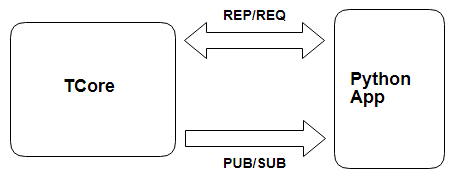

# 注意事項

1. 分頁查詢需要帶入QryIndex(帶空則回第一頁)，每頁50筆資料，拿最後一筆QryIndex資訊可以往下查，最後一頁則回空資料。

2. service會通過PUB連線發送PING訊息，客戶端需要發送PING請求來回應，超過一分鐘service沒收到回應則會清掉該連線session

 

* Client App行情需建立兩條ZeroMQ連線，一條REP/REQ連線，一條PUB/SUB連線。若要連接交易，需再建立另兩條REP/REQ、PUB/SUB連線。
